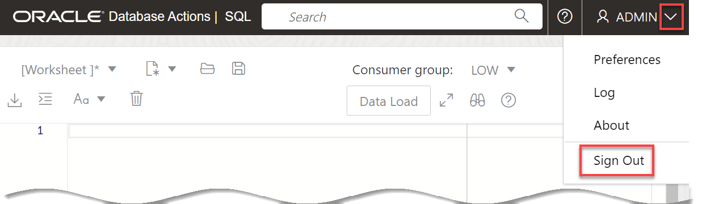

# Create Schema Owner

## Introduction

In this lab, as the **`admin`** user account, you will create a new user named **hol23** and grant this user all necessary roles and privileges as a schema owner.

Estimated Time: 5 minutes

### Objectives

In this lab, you will:

* Create a user that will be the schema owner.

### Prerequisites

This lab assumes that you have successfully completed all of the preceding labs in the **Contents** menu on the left.

## Task 1: Navigate to the SQL Worksheet

1. Log in to the **Oracle Cloud Console**, if you are not already logged in.

2. Open the **Navigation** menu and click **Oracle Database**. Under **Oracle Database**, click **Autonomous Database**.

3. On the **Autonomous Databases** page, click your **ADW-Data-Lake** ADB instance.
    

4. On the **Autonomous Database details** page, click the **Database actions** drop-down list, and then click **SQL**.

    

5. The SQL Worksheet is displayed.

    

## Task 2: Create a New Database User

As the **`admin`** user, create a **hol23** user and grant this user the required role and privileges and enable REST so we can connect to our database as that user instead of ADMIN.

1. Create a **hol23** user and grant this user the required role and privileges and enable REST and data sharing. Copy and paste the following script into your SQL Worksheet, and then click the **Run Script (F5)** icon in the Worksheet toolbar.

    ```
    <copy>
    -- Create a new user that will provide the shared data.

    CREATE USER hol23 IDENTIFIED BY Welcome123;

    -- Grant the new user the required role and privileges.

    GRANT CONNECT TO hol23;
    GRANT DWROLE TO hol23;
    GRANT RESOURCE TO hol23;
    GRANT UNLIMITED TABLESPACE TO hol23;

    -- Enable REST.

    BEGIN
        ORDS_ADMIN.ENABLE_SCHEMA(
            p_enabled => TRUE,
            p_schema => 'hol23',
            p_url_mapping_type => 'BASE_PATH',
            p_url_mapping_pattern => 'hol23',
            p_auto_rest_auth=> TRUE
        );

    -- Enable data sharing.
        DBMS_SHARE.ENABLE_SCHEMA(
        SCHEMA_NAME => 'hol23',
        ENABLED => TRUE
        );
       commit;
    END;
    /
    </copy>
    ```

    

    The results are displayed in the **Script Output** tab.

    

2. Log out of the **`ADMIN`** user. On the **Oracle Database Actions | SQL** banner, click the drop-down list next to the **`ADMIN`** user, and then select **Sign Out** from the drop-down menu. When prompted if you want to leave the site, click **Leave**.

    

3. Log in as the newly created user, **`hol23`**. On the **Sign-in** page, enter **`hol23`** as the username and **`Welcome123`** as the password, and then click **Sign in**.

    

    You are now logged in as the newly created **`hol23`** user. On the Launchpad, click the **Development** tab, and then click the **SQL** tab.

    

    The SQL Worksheet is displayed.

    


You may now proceed to the next lab.

## Learn More

* [Oracle Cloud Infrastructure Documentation](https://docs.cloud.oracle.com/en-us/iaas/Content/GSG/Concepts/baremetalintro.htm)
* [Using Oracle Autonomous Database Serverless](https://docs.oracle.com/en/cloud/paas/autonomous-database/adbsa/index.html)
