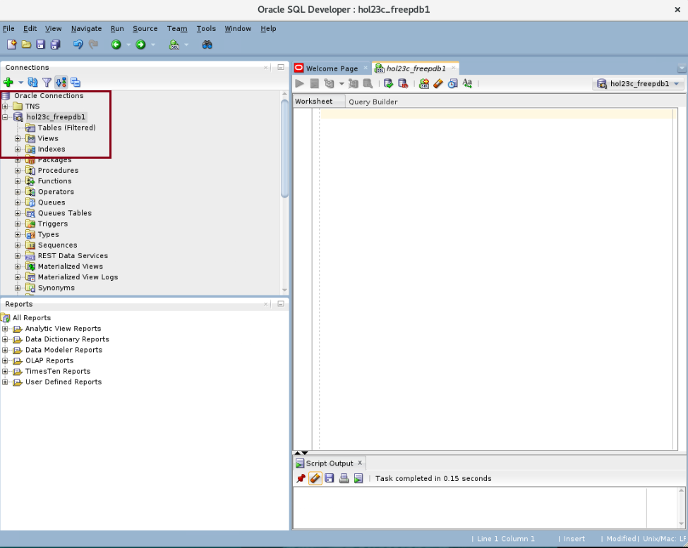
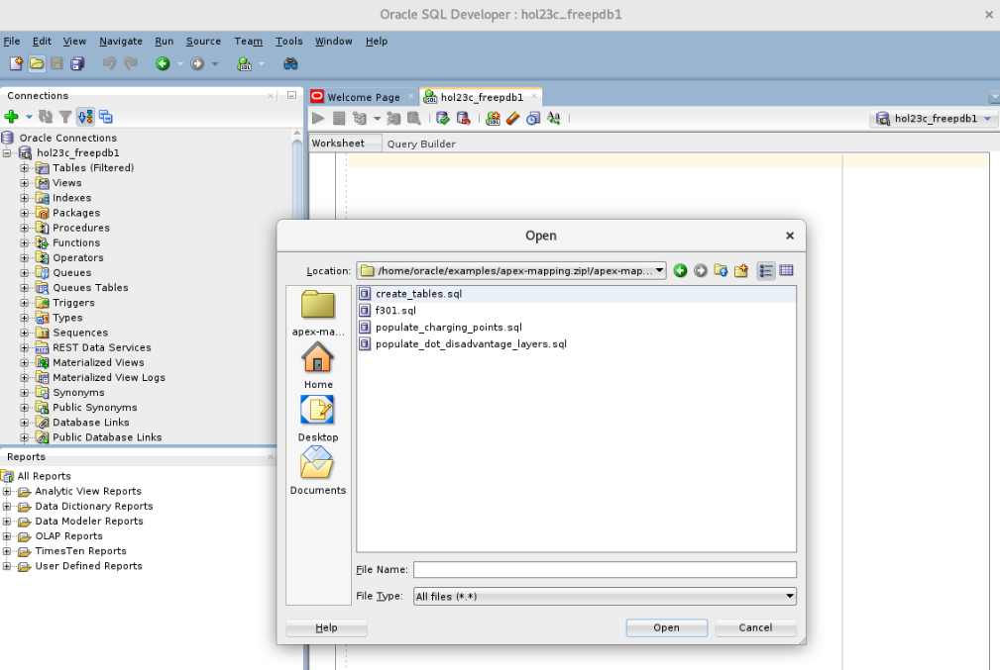
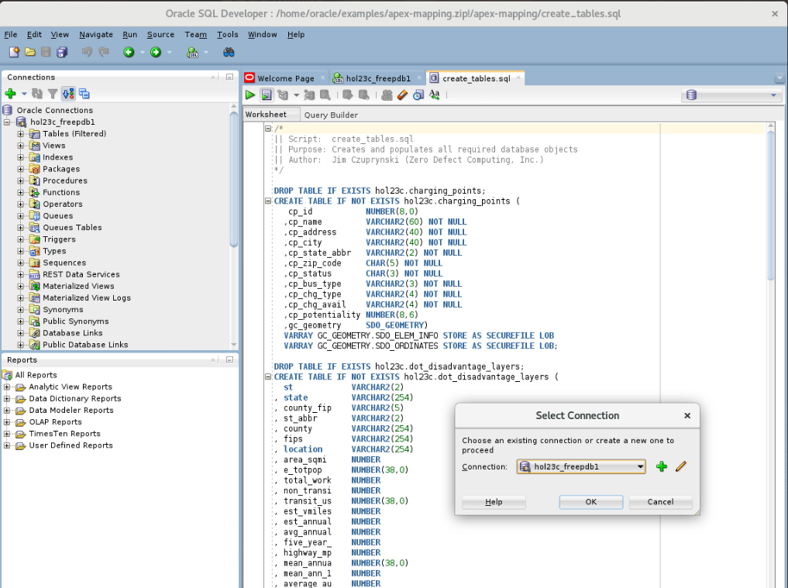
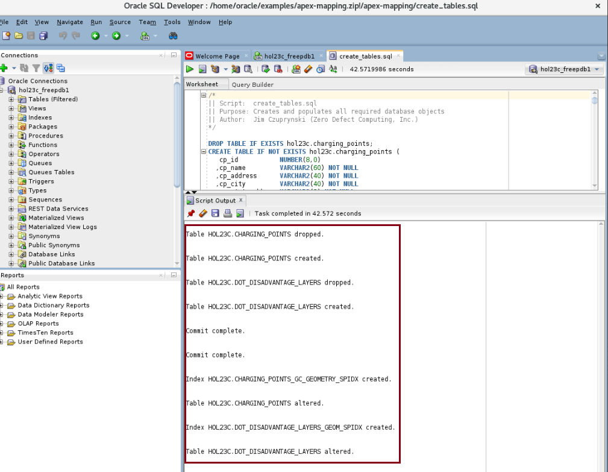

# Prepare Database Objects

## Introduction

Before we can begin using APEX to visualize and analyze Operational Property Graphs, we must first create and populate tables and other database objects containing our data sources. This lab assumes that you have already created your Oracle Autonomous Database 23ai Always Free instance and explored the database tools available for accessing your database environment, especialy SQL Developer Web.

Estimated Time: 10 minutes

### Objectives

In this lab, you will:

- Use SQL Web Developer to connect to your ADB instance
- Create all needed database objects and populate them with data

### Prerequisites

This lab assumes you have completed all previous labs successfully.

## Task 1: Download the schema creation and population scripts and files

1. Select a local folder on your computer that will become a target for downloaded files. In this example, we are using a Microsoft Windows 11 environment, and we'll use the **Downloads** folder to store files locally.

   


2. Pull down the materials for setup.

    ```
    $ <copy>wget https://objectstorage.us-ashburn-1.oraclecloud.com/p/b1_vZe_9llVqw_oTDq-SQyRrkDshcuABTHc6QuUDG984jfUi0mbk5x7pOZ7mPDPh/n/c4u04/b/livelabsfiles/o/partner-solutions/[new_dirctory]opg-visualization.zip</copy>
    ```

    

3. Inside this ZIP file are the files to set up and populate your schema's database objects as well as create the **OPG** APEX application. Unzip the file to your chosen local directory, either via command line utility, or in Windows by selecting the ZIP file, selecting the *Extract All ...* option, and specifying the destination directory if desired.

    ```
    $ <copy>unzip -o opg-visualization.zip</copy>
    ```

    

4. If desirable to save disk space, remove the remaining zip file after you've unzipped it.

## Task 2: Open SQL Web Developer


### ** CAPTURE THIS FROM RAG25 WHEN FINISHED! **
### ** CAPTURE THIS FROM RAG25 WHEN FINISHED! **
### ** CAPTURE THIS FROM RAG25 WHEN FINISHED! **


    


*. Fill out the connection information with your password. The default password we will be using throughout this lab is **Welcome123**. If you have changed yours, please use that one. After you click okay, you should be connected to your user.

    

## Task 3: Create and populate database tables and related objects

1. Now that you have logged into SQL Web Developer, let's get familiar with some of its tools and features.

From the left-side panel, you can view information about the different database components within the HOL23C schema. Expand the hol23c_freepdb1 node on the tree view to see tables, indexes, and other objects. If you click into the **tables** node, you'll note that there are no tables present yet.

   

2. Click File -> Open and navigate to the **/home/oracle/examples/apex-mapping** folder.

   

3. We will now build and populate all of the database objects needed to demonstrate the features of JRDVs.

- Open the file named **create_tables.sql** by clicking on the *File ... Open* icon. 
- Click the button that shows a document with the small green play button on it to run the whole script.
- If it asks you to select a connection in a popup window, choose **hol23c_freepdb1** from the drop down and then click OK.

   

- Then either click on the Run Script button or simply hit F5 to run the script. It should take approximately 90 seconds or less to complete.

4. Browse through the script output from the file's execution. You should see that:

- Four tables have been proactively dropped (if they had already existed).
- Four tables have been created.

- The first SQL script, **populate_charging_points.sql,** loaded table CHARGING_POINTS because its GC_GEOMETRY column's datatype (SDO_GEOMETRY) requires special handling during population.
- The second SQL script, **populate_dot_disadvantage_layers.sql,** loaded table DOT_DISADVANTAGE_LAYERS separately because its GEOM column's datatype also requires special handling.

- Primary key constraints and corresponding indexes were created for both tables.


   

5. Your schema setup is now complete. You may proceed to the next lab.

## Learn More
- [[ ANY VALID ONES ?? ]]


## Acknowledgements
* **Author** - Jim Czuprynski
* **Contributors** - Jim Czuprynski, LiveLabs Contributor, Zero Defect Computing, Inc.
* **Last Updated By/Date** - Jim Czuprynski, November 2024