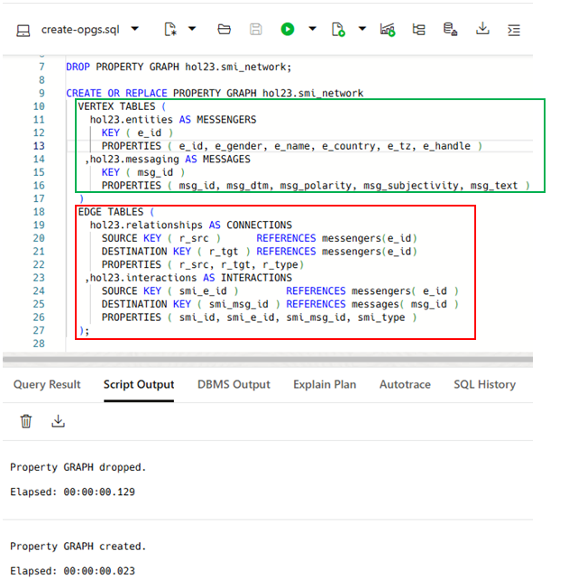
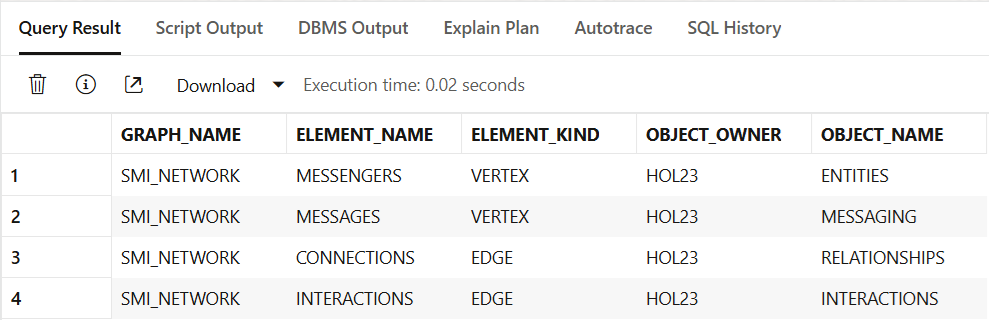
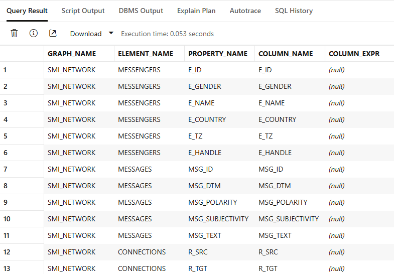
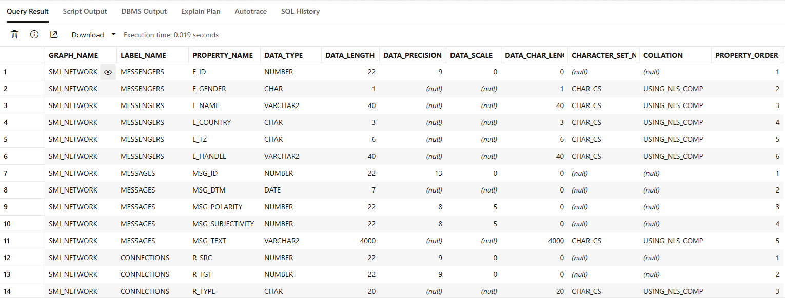
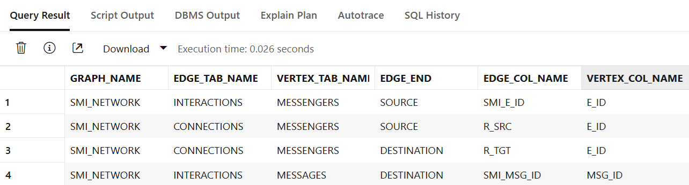
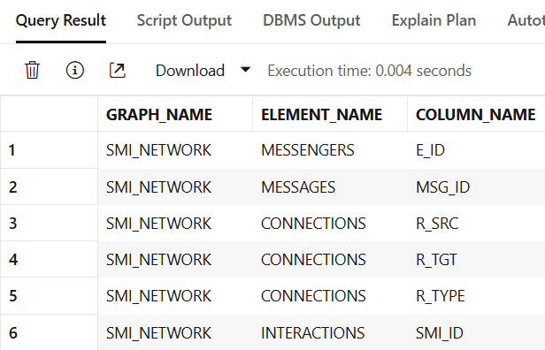
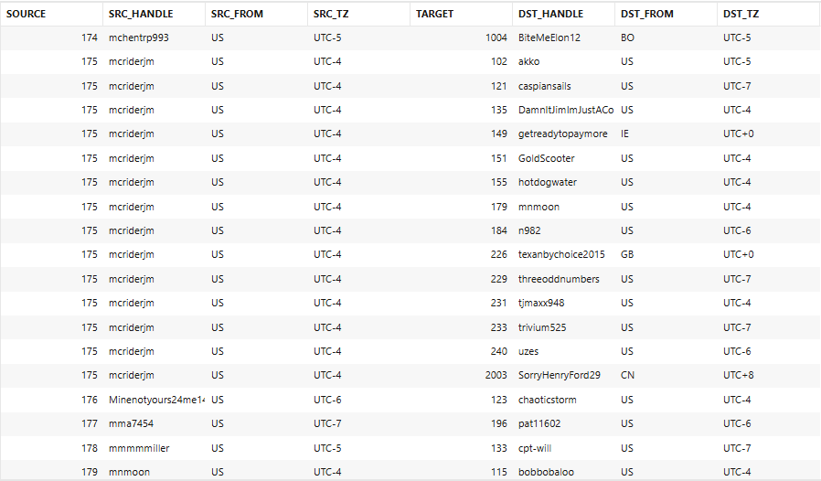
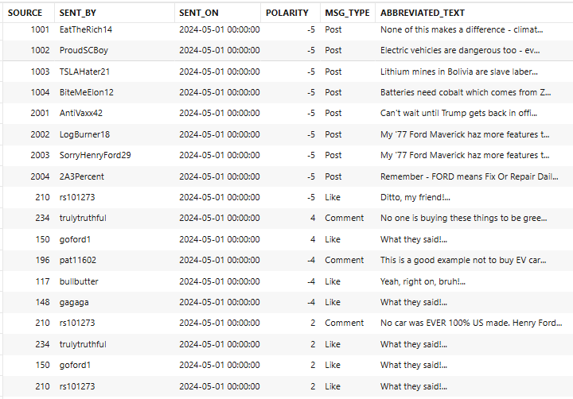
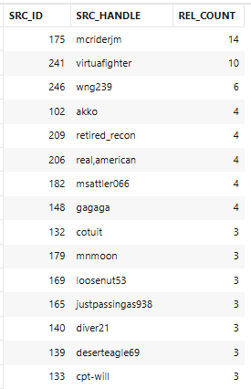
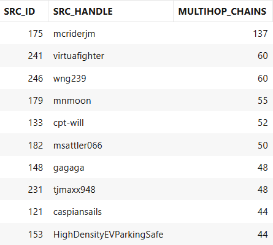

# Create and Explore Operational Property Graphs

## Introduction

Our next step is to create an Operational Property Graph (OPG) and then use the new Oracle 23ai MATCH clause in SQL to explore data within the OPG.
This lab assumes that you have already configured an Oracle ADB 23ai Always Free database.

Estimated Time: N minutes

### Objectives

In this lab, you will:

- Use SQL Web Developer to connect to your ADB instance
- Create an Operational Property Graph and review its metadata
- Query various dimensions of the Operational Property Graph via SQL and the new 23ai MATCH clause

### Prerequisites

This lab assumes you have completed all previous labs successfully.

## Task 1: Open SQL Web Developer

[[ REWRITE THIS TO REFERENCE STANDARD SWD MDS!! ]]

1. From . . . 

    ```
    $ <copy>cd /opt/sqldeveloper/</copy>
    ```
    ```
    $ <copy>./sqldeveloper.sh</copy>
    ```

    


*. Fill out the connection information with your password. The default password we will be using throughout this lab is **Welcome123**. If you have changed yours, please use that one. After you click okay, you should be connected to your user.

    

## Task 2: Create an OPG
Creating an OPG is as simple as creating any Oracle database view. We'll create a new OPG to represent our social media network and then probe its elements for a full understanding of its graph database model.

1. Click . . . [[ finish this !! ]]

    

    Next, copy the SQL statement below into your SQL Web Developer worksheet and then execute it by either pressing **F5** or clicking on the *Execute Script* button in the toolbar at the top.

    ```
    $ <copy>
    DROP PROPERTY GRAPH hol23.smi_network;

    CREATE OR REPLACE PROPERTY GRAPH hol23.smi_network
    VERTEX TABLES (
        hol23.entities AS MESSENGERS
        KEY ( e_id )
        PROPERTIES ( e_id, e_gender, e_name, e_country, e_tz, e_handle )
    ,hol23.messaging AS MESSAGES
        KEY ( msg_id )
        PROPERTIES ( msg_id, msg_dtm, msg_polarity, msg_subjectivity, msg_text )
    )
    EDGE TABLES (
        hol23.relationships AS CONNECTIONS
        SOURCE KEY ( r_src )      REFERENCES messengers(e_id)
        DESTINATION KEY ( r_tgt ) REFERENCES messengers(e_id)
        PROPERTIES ( r_src, r_tgt, r_type)
    ,hol23.interactions AS INTERACTIONS
        SOURCE KEY ( smi_e_id )        REFERENCES messengers( e_id )
        DESTINATION KEY ( smi_msg_id ) REFERENCES messages( msg_id )
        PROPERTIES ( smi_id, smi_e_id, smi_msg_id, smi_type )
    );
    </copy>
    ```
    You'll notice that the OPG is dropped (if it already existed previously) and then created.
    
    

    Here's what the CREATE PROPERTY GRAPH statements above actually do. The statements outlined in the *green* box map the appropriate tables and their columns to **nodes** within the OPG. We have defined *two* sets of nodes:

    * The **MESSENGERS** node identifies the entities - persons or organizations - within the social media network.
    * Meanwhile, the **MESSAGES** node corresponds to messages that have been sent by a person to someone else within the network.

    And the statements outlined in the *red* box map the appropriate tables and their columns to **edges** within the OPG. Our OPG actually has *two* edges:
    
    * The **CONNECTIONS** edge describes the type of connections established between entities - for example, a person who is *followed by* another person. 
    * The **INTERACTIONS** edge describes the interactions that have happened between entities throughout the social media network - for example, a message sent from one person to another, or a "like" recorded by one person about another person's message.

2. Let's take a closer look at our OPG's metadata. Copy these SQL statement below into your SQL Web Developer worksheet and then execute each query in the script:

    ```
    $ <copy>
    -- View OPG elements and underlying tables
    SELECT * FROM user_pg_elements;

    -- View OPG element details
    SELECT * FROM user_pg_prop_definitions;

    -- Show details of OPG property names
    SELECT * FROM user_pg_label_properties;

    -- Show details on OPG edges and node relationships
    SELECT * FROM user_pg_edge_relationships;

    -- What keys are the OPGs using to uniquely identify elements?
    SELECT * FROM user_pg_keys;
    </copy>
    ```
Since in essence an OPG is simply a *database view,* each of these queries reveals how the OPG is mapped to their underlying tables and columns. View **USER_PG_ELEMENTS** describes how vertices and edges are mapped to their table counterparts:



View **USER_PG_PROP_DEFINITIONS** shows how each column selected in the CREATE PROPERTY VIEW DDL statement maps to corresponding OPG properties. Just like any other Oracle database view, it's not necessary to select every column in an underlying table:



View **USER_PG_LABEL_PROPERTIES** details the properties of each column that's been selected for the OPG:



View **USER_PG_EDGE_RELATIONSHIPS** describes the edges of the OPG and whether the underlying column is classified as a *source* or *destination* of the edge:



Finally, view **USER_PG_KEYS** lists the column(s) selected as the unique identifiers for the underlying data in the OPG. These columns are typically primary or unique keys within each of the tables representing the nodes in the graph:



## Task 3: Query the OPG's contents for meaningful business information

Still connected to your database via SQL Web Developer, let's now take a deeper look at how to leverage the MATCH clause within 23ai SQL to explore vertices (also known as *nodes*) and edges within an OPG.

1. Let's start with a simple example of the power of the GRAPH_TABLE function in Oracle 23ai and the MATCH clause. This query shows how a person (*node*) is linked to other people in their social media network based on their relationship (e.g. following someone within the network), represented as an *edge* named **CONNECTIONS** in the graph model.  Copy the SQL statement below into your SQL Web Developer worksheet and execute it:
    ```
    $ <copy>
    SELECT *
      FROM GRAPH_TABLE(
      smi_network
      MATCH (m1) - [p IS CONNECTIONS] -> (m2)
      COLUMNS (
        p.r_src AS source
      , m1.e_handle AS src_handle
      , m1.e_country AS src_from
      , m1.e_tz AS src_tz
      , P.r_tgt AS target
      , m2.e_handle AS dst_handle
      , m2.e_country AS dst_from
      , m2.e_tz AS dst_tz
      )
    );
    </copy>
    ```
    As the output shows, several people are connected to just a few others, but in one particular case - entity #175, who goes by the handle *mcriderjm* - is followed by quite a few connections, and therefore might be considered an *influencer* within the network.

    

2. Here's another simple query that shows the relationships between the *messengers* (the entities sending messages) and the *messages* they sent to other entities in the social media network. Copy the SQL statement below into your SQL Web Developer worksheet and execute it: 

    ```
    $ <copy>
    SELECT *
        FROM GRAPH_TABLE(
            smi_network
            MATCH (m1 IS MESSENGERS ) - [p IS INTERACTIONS] -> (m2 IS MESSAGES)
            COLUMNS (
                p.smi_e_id AS source
            , m1.e_handle AS sent_by
            , TO_CHAR(m2.msg_dtm,' YYYY-MM-DD HH24:MI:SS') AS sent_on
            , m2.msg_polarity AS polarity
            , p.smi_type AS msg_type
            , SUBSTR(m2.msg_text, 1, 40) || '...' AS abbreviated_text
            )
        );
    </copy>
    ```

    Note that this query connects messengers to the messages they've sent by linking them along a different edge - *INTERACTIONS* - than we used in the first query.

    

3. Here's another simple query looks for the most prolific "connectors" within the social media network by counting the number of followers each messenger has made. Copy the SQL statement below into your SQL Web Developer worksheet and execute it: 

    ```
    $ <copy>
    SELECT 
    src_id
    , src_handle
    , COUNT(*) AS rel_count
    FROM GRAPH_TABLE(
        smi_network
        MATCH (m1 IS MESSENGERS)-[p IS CONNECTIONS]->(m2 IS MESSENGERS)
        COLUMNS (
        m1.e_id     as src_id
        ,m1.e_handle as src_handle
        ,m2.e_id     as tgt_id
        ,m2.e_handle as tgt_handle)  
    ) 
    GROUP BY src_id, src_handle
    ORDER BY rel_count DESC
    FETCH FIRST 15 ROWS ONLY;    
    </copy>
    ```
    

    As the output shows, entity #175 (*mcriderjm*) is definitely the one with the most followers in our network.

4. Here's another query that uses the slightly more complex format of the MATCH command to identify just the people who have either *one* (Jim - > Bob), *two* (Jim -> Bob -> Mike), or *three* (Jim -> Bob -> Mike -> Gary) outbound connections.
   
   We're also counting each connection in the expression labeled as *multihop_chains* and then sorting that result set in descending order so we can apply the FETCH FIRST clause to identify only the top ten people in the social media network and are therefore likely the key influencers within the network.

   Copy the SQL statement below into your SQL Web Developer worksheet and execute it: 

    ```
    $ <copy>
    SELECT src_id, src_handle, COUNT(1) AS multihop_chains
      FROM GRAPH_TABLE(
        smi_network
        MATCH (m1 IS MESSENGERS)-[p IS CONNECTIONS]->{1,3}(m2 IS MESSENGERS)
        COLUMNS (
        m1.e_id AS src_id,  m1.e_handle AS src_handle
        ,m2.e_id AS tgt_id,  m2.e_handle AS tgt_handle)  
    ) 
     GROUP BY src_id, src_handle
     ORDER BY multihop_chains DESC
     FETCH FIRST 10 ROWS ONLY;
    </copy>
    ```

    As the output shows, ...

    

5. Finally, how would we go about finding *potential trolls* among our social media network's messengers? It's actually quite simple with OPGs!

    Copy this SQL statement below into your SQL Web Developer worksheet and execute it:
    ```
    $ <copy>
    SELECT
         followers.src_id     ,followers.src_handle
        ,followed.followed_by ,followers.following
        FROM 
        (SELECT src_id, src_handle, COUNT(src_id) AS following
            FROM GRAPH_TABLE(
                smi_network
                MATCH (m1 IS MESSENGERS)-[p IS CONNECTIONS]->(m2 IS MESSENGERS)
                COLUMNS (m1.e_id AS src_id, m1.e_handle as src_handle)  
            ) GROUP BY src_id, src_handle ) followers
        , (SELECT tgt_id, COUNT(tgt_id) AS followed_by
            FROM GRAPH_TABLE(
                smi_network
                MATCH (m1 IS MESSENGERS)-[p IS CONNECTIONS]->(m2 IS MESSENGERS)
                COLUMNS (m2.e_id AS tgt_id)  
            )  GROUP BY tgt_id) followed
        WHERE followers.src_id = followed.tgt_id
        AND followed_by >= 5
        AND following <= 5
        ORDER BY followed_by DESC;
    </copy>
    ```

    This query combines the result sets from two separate GRAPH_TABLE queries - one that identifies all members who are followed by **5 or more** members, and a second query that identifies who is being followed by **5 or fewer** members - and then joins the results together based on the entities' entity ID. The ones outlined in the red boxes are suspected "sock puppet" accounts that our social media managers would investigate as potential trolls once they've excluded any valid influencers.

    

6. Your explorations of this OPG are now complete. You may proceed to the next lab.

## Learn More
- [Oracle Property Graphs Concepts and Usage]( [[ need link ]] )


## Acknowledgements
* **Author** - Jim Czuprynski
* **Contributors** - Jim Czuprynski, LiveLabs Contributor, Zero Defect Computing, Inc.
* **Last Updated By/Date** - Jim Czuprynski, November 2024